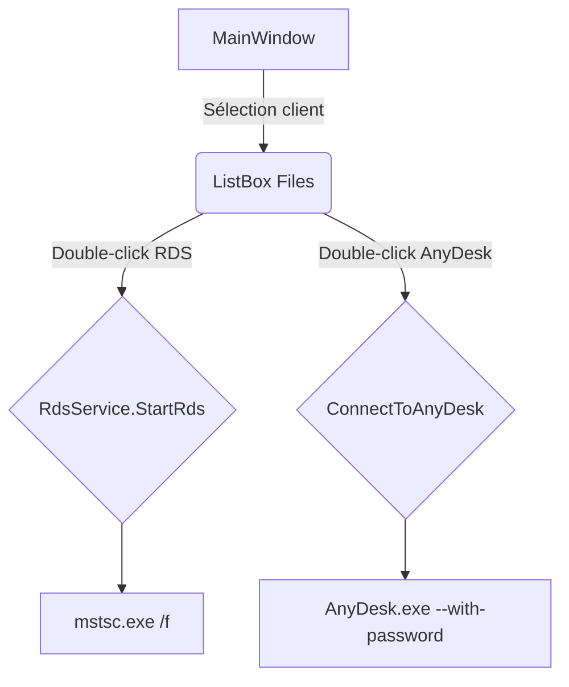

# Acces Client WPF — v 1.3.1 « Copy & Share »

> **Une seule appli Windows pour ouvrir, gérer et partager tous les accès client (RDS, AnyDesk, VPN, dossiers, fichiers, flux d’aide…) dans une interface WPF moderne.**
> Version 1.3.1 corrige le bug du caractère unique sous AnyDesk et ajoute un accès direct à la base partagée.

---

## Sommaire

1. [Fonctionnalités clés](#fonctionnalités-clés)
2. [Screenshots](#screenshots)
3. [Installation](#installation)
4. [Premiers pas](#premiers-pas)
5. [Flux de travail](#flux-de-travail)
6. [Configuration et fichiers](#configuration-et-fichiers)
7. [Raccourcis & commandes](#raccourcis--commandes)
8. [Roadmap](#roadmap)
9. [Contribuer](#contribuer)
10. [Changelog abrégé 1.3.1](#changelog-abrégé-131)
11. [Licence](#licence)

---

## Fonctionnalités clés

| Catégorie                         | Détails                                                                                                                                                                                                                                                                                                        |
| --------------------------------- | -------------------------------------------------------------------------------------------------------------------------------------------------------------------------------------------------------------------------------------------------------------------------------------------------------------- |
| **Gestion d’accès**               | • **RDS** (multi-moniteur, titre de session personnalisé, stockage temporaire d’identifiants)<br>• **AnyDesk** (auto-remplissage mot de passe, détection dynamique du chemin `AnyDesk.exe`)<br>• **VPN** (ex. FortiClient — simulation pour l’instant)<br>• **Ouverture dossiers / fichiers** locaux ou réseau |
| **Base clients**                  | • Liste clients + listage filtré de leurs accès<br>• Classement manuel (drag & drop, montée/descente)<br>• Cryptage AES 256 des mots de passe                                                                                                                                                                  |
| **Base partagée**                 | • Accès one-click au partage réseau `\\172.16.xxx.xxx\Partage\XXX\Administration XXX`<br>• Éditeur complet d’une base JSON mutualisée                                                                                                                                                       |
| **Clipboard intelligent (1.3.1)** | • Copie login/mot de passe en **Text** *et* **UnicodeText** → compatibilité AnyDesk / RDP / VMware                                                                                                                                                                                                             |
| **UI/UX**                         | • Thème clair, icônes dynamiques (`FileTypeToIconConverter`)<br>• Boutons arrondis, fenêtres centrées, messages contextualisés                                                                                                                                                                                 |
| **Aide & extranet**               | • Lancement contextuel d’une aide HTML hors-ligne (Dropbox) avec fallback de navigateur<br>• Accès extranet Volume-Software                                                                                                                                                                                    |
| **Paramétrage**                   | • Chemin AnyDesk persistant (`settings.json`)<br>• AES key/IV intégrés (peuvent être externalisés)<br>• Multi-fichiers de base (`database.json`, `rds_accounts.json`)                                                                                                                                          |
| **Sécurité**                      | • Stockage chiffré AES pour passwords<br>• CmdKey temporaire (RDS) + nettoyage automatique                                                                                                                                                                                                                     |

---

## Screenshots


---

## Installation

```bash
# pré-requis
• Windows 10/11
• .NET Desktop Runtime 8.x
• Droits d’écriture dans le dossier d’installation (pour les JSON)
• Accès réseau au partage \\172.16.0.49\Partage\Volume\...

# exécutable
1. Télécharger le zip/installer depuis Releases > v1.3.1
2. Décompresser/lancer `AccesClientWPF.exe`
3. Au premier démarrage :
   – choisir l’exécutable AnyDesk s’il n’est pas détecté  
   – pointer la base partagée si besoin
```

---

## Premiers pas

| Étape | Action                                                                         |
| ----- | ------------------------------------------------------------------------------ |
| 1️⃣   | **Créer / importer** vos clients via ⚙️ *Gestion Clients*                      |
| 2️⃣   | **Ajouter** un accès (RDS, AnyDesk, VPN…) via ➕ *Ajouter élément*              |
| 3️⃣   | **Double-cliquez** sur l’accès pour vous connecter / ouvrir                    |
| 4️⃣   | **Copiez** identifiants via 📋 (compatible AnyDesk grâce au nouveau clipboard) |
| 5️⃣   | **Partagez** ou éditez la base commune via 🗄 *Base partagée*                  |

---

## Flux de travail



---

## Configuration et fichiers

| Fichier             | Rôle                          |
| ------------------- | ----------------------------- |
| `database.json`     | Clients + accès (local)       |
| `rds_accounts.json` | Carnet d’adresses RDS complet |
| `settings.json`     | Chemin AnyDesk, prefs UI      |
| `VoluHelp/*`        | Aide HTML hors-ligne          |
| `Resources/*.png`   | Icônes intégrées              |

> **Tip :** mettez ces JSON dans un repo Git ou un dossier Dropbox pour sauvegarder vos accès.

---

## Raccourcis & commandes

| Vue           | Touche/BTN                                     | Effet                                        |
| ------------- | ---------------------------------------------- | -------------------------------------------- |
| MainWindow    | **F2**                                         | Renommer l’élément sélectionné               |
| MainWindow    | **Suppr**                                      | Supprimer l’accès                            |
| Context Menu  | **Envoyer vers En cours / En test / Terminée** | Mouvements rapides des tâches (PlanifKanban) |
| Bouton **📋** | Copie login / password dans 2 formats          |                                              |
| **Ctrl + H**  | Aide hors-ligne                                |                                              |

---

## Roadmap

* [ ] Connexion VPN FortiClient native (arguments, statut)
* [ ] Thème sombre (auto selon Windows)
* [ ] Signature de l’exécutable + auto-updater Delta Patch

---

## Contribuer

1. **Fork** le repo
2. `git checkout -b feature/ma-feature`
3. `dotnet build` + tests manuels
4. Pull-request vers `develop` avec un changelog *un.lined*

> Tests unitaires à venir (xUnit) : helpers ClipBoard, Encryption, Services mocks.

---

## Changelog abrégé 1.3.1

| Type | Ticket | Résumé                                             |
| ---- | ------ | -------------------------------------------------- |
| ✨    | #87    | **ClipboardHelper** — copie Text & UnicodeText     |
| 🐛   | #86    | Fix *AnyDesk one-char paste*                       |
| 🚀   | #85    | Bouton **Base partagée** → ouvre `\\172.16.0.49\…` |
| 🧹   | #84    | Refactor `Clipboard.SetText` → helper unique       |
| 📚   | #83    | README/CHANGELOG mis à jour                        |


---

## Licence

Code sous **MIT**.
Icônes et logos restent la propriété de leurs détenteurs respectifs.
